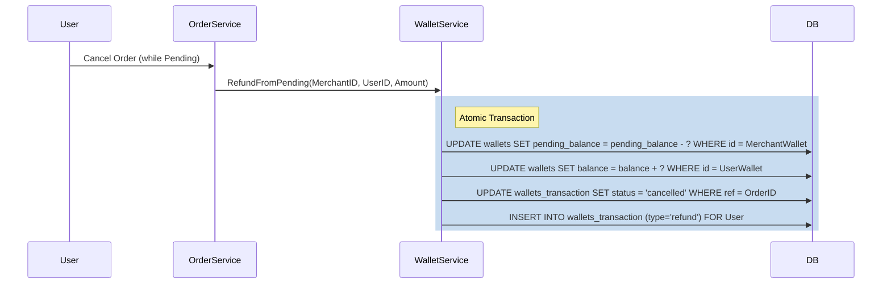

# Design Spec: Wallet Escrow System (Merchant Pending Balance)

## 1. Problem Statement
The marketplace currently lacks a way to hold funds in escrow. When a user pays for an order, the money should be held in a "Pending" state in the merchant's wallet and only released to the "Available" balance once the user confirms the order arrival. 

Additionally, if a user pays via a 3rd party gateway or wallet, and the order is cancelled, the system should support refunding those funds directly into the user's internal wallet.

## 2. Proposed Changes

### 2.1 Database Schema updates
We will modify the `wallets` and `wallets_transaction` tables to support dual-balance tracking.

```sql
-- Add pending_balance to wallets
ALTER TABLE wallets 
ADD COLUMN pending_balance numeric(15,2) DEFAULT 0.00 NOT NULL;

-- Add pending_balance_after to transactions for audit trail
ALTER TABLE wallets_transaction 
ADD COLUMN pending_balance_after numeric(15,2) DEFAULT 0.00 NOT NULL;
```

### 2.2 Domain Layer (`internal/domain/wallet.go`)
Update the `Wallet` and `WalletTransaction` entities to include the new fields.

```go
type Wallet struct {
    ID             uuid.UUID
    UserID         uuid.UUID
    Balance        decimal.Decimal
    PendingBalance decimal.Decimal // NEW
    ...
}

type WalletTransaction struct {
    ...
    BalanceAfter        decimal.Decimal
    PendingBalanceAfter decimal.Decimal // NEW
    ...
}
```

### 2.3 Core Business Logic
The `WalletRepository` and `WalletService` will handle four primary operations:

1.  **CreditPending**: Used when an order is paid.
    - `MerchantWallet.PendingBalance += Amount`
    - Create `WalletTransaction` (status: pending, type: payment) for Merchant.
2.  **SettlePending**: Used when an order is confirmed.
    - `MerchantWallet.PendingBalance -= Amount`
    - `MerchantWallet.Balance += Amount`
    - Update Merchant's `WalletTransaction` status to `success`.
3.  **RefundFromPending**: Used when a pending order is cancelled.
    - `MerchantWallet.PendingBalance -= Amount`
    - `UserWallet.Balance += Amount` (Refund goes to user's wallet)
    - Update Merchant's transaction status to `cancelled`.
    - Create new `WalletTransaction` (status: success, type: refund) for User.
4.  **DeductAvailable**: Used for withdrawals.
    - `Wallet.Balance -= Amount` (checking that `Balance >= Amount`).

## 3. Data Flow (Refund Case)



## 4. Error Handling & Safety
- **Atomic Transactions**: All balance updates and transaction log inserts MUST happen within a single SQL transaction (`sqlx.Tx`).
- **Negative Balance Protection**: Ensure `PendingBalance` never goes below zero.
- **Audit Integrity**: `balance_after` and `pending_balance_after` must be captured *after* the update.

## 5. Future Considerations
- **Platform Fees**: Split `SettlePending` into Merchant earnings and Platform earnings.
