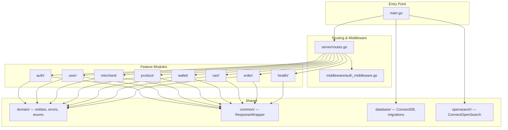
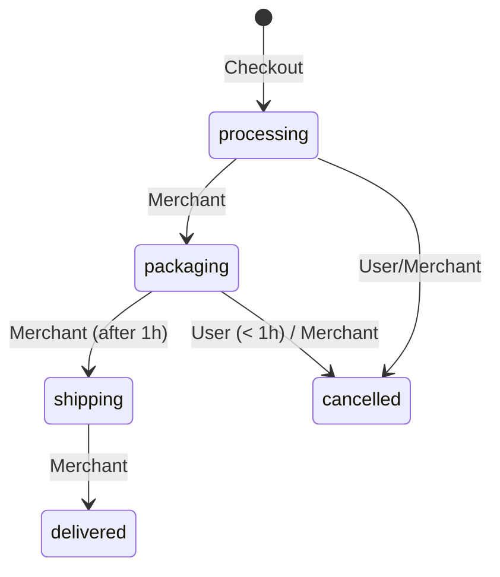

# Go Shop Yourself — Technical Documentation

> Comprehensive reference for the **Go Shop Yourself** e-commerce backend API.

---

## Table of Contents

1. [Overview](#overview)
2. [Tech Stack](#tech-stack)
3. [Architecture](#architecture)
4. [Configuration](#configuration)
5. [API Reference](#api-reference)
   - [Authentication](#authentication)
   - [Users](#users)
   - [Merchants](#merchants)
   - [Products](#products)
   - [Wallets](#wallets)
   - [Cart](#cart)
   - [Orders](#orders)
   - [Health](#health)
6. [Domain Models](#domain-models)
7. [Business Rules](#business-rules)
8. [Database Migrations](#database-migrations)
9. [Development Workflow](#development-workflow)

---

## Overview

**Go Shop Yourself** is a full-featured e-commerce backend service built in Go. It exposes a RESTful JSON API for user registration, merchant onboarding, product management, shopping cart, checkout, digital wallet, and order lifecycle management.

All responses follow a consistent envelope format:

```json
{
  "message": "descriptive message",
  "status": 200,
  "data": { ... }
}
```

---

## Tech Stack

| Layer | Technology |
|:---|:---|
| Language | Go 1.25.8+ |
| Web Framework | Fiber v2 |
| Database | PostgreSQL (via `pgxpool`) |
| Search Engine | OpenSearch v3 |
| Migrations | `golang-migrate` |
| Auth | JWT (`golang-jwt/v5`) + bcrypt |
| Docs | Swagger/OpenAPI (`swaggo/swag`) |
| Testing | `testify`, `pgxmock`, `mockery` |
| Decimal math | `shopspring/decimal` |

---

## Architecture

The project uses a **Feature-Based Architecture**. Each domain lives in its own package under `internal/` with a consistent layered structure:

```
Handler (HTTP) → Service (Business Logic) → Repository (Data Access)
```



### Module Structure (per feature)

Each feature package contains:

| File | Purpose |
|:---|:---|
| `*_handler.go` | HTTP handlers + Swagger annotations |
| `*_service.go` | Business logic + interface definitions |
| `*_repo.go` | PostgreSQL data access |
| `*_dto.go` | Request/Response DTOs + validation |
| `*_service_test.go` | Unit tests for service layer |
| `*_handler_test.go` | Unit tests for handler layer |
| `mock_*.go` | Auto-generated mocks (mockery) |

---

## Configuration

### Environment Variables

| Variable | Description | Required |
|:---|:---|:---|
| `PORT` | Application port | No (default: `3000`) |
| `DB_HOST` | PostgreSQL host | Yes |
| `DB_PORT` | PostgreSQL port | Yes |
| `DB_USER` | PostgreSQL username | Yes |
| `DB_PASS` | PostgreSQL password | Yes |
| `DB_NAME` | PostgreSQL database name | Yes |
| `JWT_SECRET` | Secret key for JWT signing | Yes |
| `APP_ENV` | Environment mode (`development` enables Swagger UI) | No |
| `OPENSEARCH_HOST` | OpenSearch cluster host | No |
| `OPENSEARCH_PORT` | OpenSearch port | No |
| `OPENSEARCH_USER` | OpenSearch auth user | No |
| `OPENSEARCH_PASSWORD` | OpenSearch auth password | No |

---

## API Reference

**Base URL**: `/api`
**Swagger UI**: `GET /swagger/*` (only when `APP_ENV=development`)

### Authentication

All protected endpoints require:
```
Authorization: Bearer <access_token>
```

> [!NOTE]
> Access tokens are short-lived JWTs. Refresh tokens are opaque, hashed, and stored in the database with **token family** support for reuse detection.

---

### Auth Endpoints

| Method | Path | Auth | Description |
|:---|:---|:---|:---|
| `POST` | `/api/auth/register` | ❌ | Register a new user |
| `POST` | `/api/auth/login` | ❌ | Login and receive tokens |
| `POST` | `/api/auth/refresh` | ❌ | Rotate refresh token |
| `POST` | `/api/auth/logout` | ✅ | Revoke token family |
| `POST` | `/api/auth/register-merchant` | ✅ | Register as merchant |

#### `POST /api/auth/register`

**Request Body:**
```json
{
  "full_name": "string (required)",
  "email": "string (required)",
  "password": "string (required, min 6 chars)",
  "username": "string (required)"
}
```

**Success Response** (`201`):
```json
{
  "message": "User registered successfully",
  "status": 201,
  "data": {
    "id": "uuid",
    "full_name": "string",
    "username": "string",
    "email": "string",
    "created_at": "timestamp",
    "access_token": "jwt",
    "refresh_token": "opaque-string"
  }
}
```

**Errors:** `400` (validation), `409` (user already exists), `500` (internal)

---

#### `POST /api/auth/login`

**Request Body:**
```json
{
  "email": "string (required)",
  "password": "string (required)"
}
```

**Success Response** (`200`): Same shape as register response.

**Errors:** `400` (validation), `401` (invalid credentials), `500`

---

#### `POST /api/auth/refresh`

**Request Body:**
```json
{
  "refresh_token": "string (required)"
}
```

**Success Response** (`200`): Same shape as register response with new tokens.

> [!WARNING]
> If a revoked refresh token is submitted, the **entire token family is invalidated** (reuse detection). All sessions for that login chain are destroyed.

**Errors:** `400`, `401` (invalid/expired/reused token), `500`

---

#### `POST /api/auth/logout` 🔒

**Request Body:**
```json
{
  "refresh_token": "string (required)"
}
```

**Success Response** (`200`): `"Logout successful"`

**Errors:** `400`, `401` (invalid token), `500`

---

### Users

| Method | Path | Auth | Description |
|:---|:---|:---|:---|
| `GET` | `/api/users/me` | ✅ | Get current user profile |
| `GET` | `/api/users/addresses` | ✅ | List saved addresses |
| `POST` | `/api/users/addresses` | ✅ | Add new address |
| `PUT` | `/api/users/addresses/:id` | ✅ | Update address |
| `DELETE` | `/api/users/addresses/:id` | ✅ | Delete address |

#### `GET /api/users/me` 🔒

**Success Response** (`200`):
```json
{
  "data": {
    "id": "uuid",
    "full_name": "string",
    "username": "string",
    "email": "string",
    "created_at": "timestamp"
  }
}
```

---

#### `POST /api/users/addresses` 🔒

**Request Body:**
```json
{
  "tag": "home | work",
  "recipient_name": "string",
  "phone_number": "string",
  "street_address": "string",
  "city": "string",
  "province": "string",
  "postal_code": "string",
  "is_default": true
}
```

> [!TIP]
> Setting `is_default: true` will automatically unset any previously default address for the user.

**Success Response** (`201`):
```json
{
  "data": {
    "id": "uuid",
    "tag": "home",
    "recipient_name": "string",
    "phone_number": "string",
    "street_address": "string",
    "city": "string",
    "province": "string",
    "postal_code": "string",
    "is_default": true,
    "created_at": "timestamp"
  }
}
```

---

#### `PUT /api/users/addresses/:id` 🔒

Same request body as `POST`. Returns updated address.

**Errors:** `400`, `401`, `403` (address doesn't belong to user), `500`

---

#### `DELETE /api/users/addresses/:id` 🔒

**Success Response** (`200`): `"Address deleted successfully"`

**Errors:** `400`, `401`, `403`, `500`

---

### Merchants

| Method | Path | Auth | Description |
|:---|:---|:---|:---|
| `POST` | `/api/auth/register-merchant` | ✅ | Register merchant profile |

#### `POST /api/auth/register-merchant` 🔒

**Request Body:**
```json
{
  "name": "string (required)",
  "about": "string",
  "tax_id": "string (required)"
}
```

> [!IMPORTANT]
> Registering as a merchant is a **transactional operation** that atomically creates both the merchant profile and a new wallet (IDR, starting balance 0).

**Success Response** (`201`):
```json
{
  "data": {
    "id": "uuid",
    "name": "string",
    "email": "string (from user profile)",
    "about": "string"
  }
}
```

**Errors:** `400`, `404` (user not found), `409` (merchant already exists), `500`

---

### Products

| Method | Path | Auth | Description |
|:---|:---|:---|:---|
| `GET` | `/api/products/search` | ❌ | Search products (public) |
| `POST` | `/api/products/` | ✅ | Create a product |
| `PUT` | `/api/products/:id` | ✅ | Update a product |

#### `GET /api/products/search`

**Query Parameters:**

| Param | Type | Default | Description |
|:---|:---|:---|:---|
| `q` | string | — | Search query (min 2 chars if provided) |
| `limit` | int | 10 | Results per page |
| `page` | int | 1 | Page number |

> [!NOTE]
> Search uses PostgreSQL's `pg_trgm` (trigram fuzzy matching) and `tsvector`

**Success Response** (`200`):
```json
{
  "data": [
    {
      "id": "uuid",
      "name": "string",
      "description": "string | null",
      "price": "decimal",
      "stock": 100,
      "is_onsale": true,
      "created_at": "timestamp"
    }
  ]
}
```

---

#### `POST /api/products/` 🔒

**Request Body:**
```json
{
  "store_id": "uuid (required — merchant ID)",
  "name": "string (required)",
  "description": "string | null",
  "price": "decimal (required, > 0)",
  "stock": "int (required, >= 0)",
  "height_cm": 0.0,
  "width_cm": 0.0,
  "depth_cm": 0.0,
  "weight_kg": 0.0,
  "is_onsale": false
}
```

**Success Response** (`201`): Product response object.

**Errors:** `400`, `404` (merchant not found), `500`

---

#### `PUT /api/products/:id` 🔒

**Request Body:**
```json
{
  "name": "string (required)",
  "description": "string | null",
  "price": "decimal (required, > 0)",
  "stock": "int (required, >= 0)",
  "is_onsale": false
}
```

**Success Response** (`200`): Updated product response.

**Errors:** `400`, `404` (product not found), `500`

---

### Wallets

| Method | Path | Auth | Description |
|:---|:---|:---|:---|
| `POST` | `/api/wallets/` | ✅ | Create wallet |
| `GET` | `/api/wallets/` | ✅ | Get wallet info |
| `GET` | `/api/wallets/history` | ✅ | Transaction history |
| `POST` | `/api/wallets/withdraw` | ✅ | Withdraw funds |

#### `POST /api/wallets/` 🔒

Creates a new digital wallet for the authenticated user.

**Success Response** (`201`):
```json
{
  "data": {
    "id": "uuid",
    "user_id": "uuid",
    "wallet_number": "WAL-xxxxxxxx",
    "balance": "0",
    "currency": "IDR",
    "status": "active",
    "created_at": "timestamp",
    "updated_at": "timestamp"
  }
}
```

**Errors:** `409` (wallet already exists), `500`

---

#### `GET /api/wallets/` 🔒

Returns current wallet details. **Same response shape as create.**

**Errors:** `404` (wallet not found), `500`

---

#### `GET /api/wallets/history` 🔒

**Query Parameters:**

| Param | Type | Default |
|:---|:---|:---|
| `page` | int | 1 |
| `limit` | int | 10 |

**Success Response** (`200`):
```json
{
  "data": [
    {
      "id": "uuid",
      "wallet_id": "uuid",
      "amount": "decimal",
      "direction": "in | out",
      "type": "topup | withdraw | payment | refund",
      "status": "pending | success | failed | cancelled",
      "reference_id": "string",
      "balance_after": "decimal",
      "description": "string",
      "created_at": "timestamp"
    }
  ]
}
```

---

#### `POST /api/wallets/withdraw` 🔒

**Request Body:**
```json
{
  "amount": "decimal (required, > 0)",
  "description": "string"
}
```

> [!IMPORTANT]
> Validates wallet is `active` and balance is sufficient **both** at the service layer (fast-fail) and atomically at the database layer.

**Success Response** (`200`): `"Withdrawal successful"`

**Errors:** `400` (insufficient balance, wallet inactive, not found), `500`

---

### Cart

| Method | Path | Auth | Description |
|:---|:---|:---|:---|
| `GET` | `/api/users/cart` | ✅ | Get cart contents |
| `POST` | `/api/users/cart` | ✅ | Add product to cart |
| `PUT` | `/api/users/cart/:productID` | ✅ | Update item quantity |
| `DELETE` | `/api/users/cart/:productID` | ✅ | Remove item |
| `DELETE` | `/api/users/cart` | ✅ | Clear entire cart |

#### `POST /api/users/cart` 🔒

**Request Body:**
```json
{
  "product_id": "uuid (required)",
  "quantity": "int (required, > 0)"
}
```

> [!NOTE]
> Uses an **upsert** strategy — if the product already exists in the cart, the quantity is updated.

**Success Response** (`201`): `"Product added to cart"`

---

#### `GET /api/users/cart` 🔒

**Success Response** (`200`):
```json
{
  "data": {
    "items": [
      {
        "id": "uuid",
        "product_id": "uuid",
        "product_name": "string",
        "price": "decimal",
        "quantity": 2,
        "subtotal": "decimal"
      }
    ],
    "total_price": "decimal"
  }
}
```

---

#### `PUT /api/users/cart/:productID` 🔒

**Request Body:**
```json
{
  "quantity": "int (required, > 0)"
}
```

---

### Orders

| Method | Path | Auth | Description |
|:---|:---|:---|:---|
| `POST` | `/api/users/orders` | ✅ | Checkout (create order) |
| `GET` | `/api/users/orders/:id` | ✅ | Get order details |
| `PUT` | `/api/users/orders/:id/cancel` | ✅ | User cancel order |
| `POST` | `/api/users/orders/:id/appeal` | ✅ | User appeal order |
| `PUT` | `/api/merchants/orders/:id/status` | ✅ | Merchant update status |
| `PUT` | `/api/merchants/orders/:id/cancel` | ✅ | Merchant cancel order |

#### `POST /api/users/orders` 🔒

**Request Body:**
```json
{
  "payment_method": "string (required)",
  "address_id": "uuid (optional — use saved address)",
  "shipping_recipient_name": "string (optional — inline address)",
  "shipping_phone_number": "string",
  "shipping_street_address": "string",
  "shipping_city": "string",
  "shipping_province": "string",
  "shipping_postal_code": "string"
}
```

> [!IMPORTANT]
> **Address resolution priority:**
> 1. `address_id` — Looks up a saved address template
> 2. Inline `shipping_*` fields — Uses custom address
> 3. Falls back to the user's **default address**
> 4. If none found → returns error

> [!NOTE]
> Checkout is a **single database transaction** that:
> 1. Locks and validates product stock (`SELECT FOR UPDATE`)
> 2. Deducts wallet balance
> 3. Creates payment record
> 4. Creates one order **per merchant** (multi-merchant split)
> 5. Creates order items + decrements stock
> 6. Clears the cart

**Success Response** (`201`):
```json
{
  "data": {
    "payment_id": "uuid",
    "amount": "decimal",
    "order_ids": ["uuid", "uuid"]
  }
}
```

---

#### `GET /api/users/orders/:id` 🔒

**Success Response** (`200`):
```json
{
  "data": {
    "id": "uuid",
    "payment_id": "uuid",
    "merchant_id": "uuid",
    "status": "processing",
    "total_amount": "decimal",
    "shipping_recipient_name": "string",
    "shipping_phone_number": "string",
    "shipping_street_address": "string",
    "shipping_city": "string",
    "shipping_province": "string",
    "shipping_postal_code": "string",
    "is_appealed": false,
    "items": [
      {
        "id": "uuid",
        "product_id": "uuid",
        "quantity": 2,
        "price": "decimal"
      }
    ],
    "created_at": "timestamp",
    "updated_at": "timestamp"
  }
}
```

---

#### `PUT /api/users/orders/:id/cancel` 🔒

Cancels the order and processes a refund.

> [!CAUTION]
> User cancellation is only permitted when:
> - Status is `processing` **or** `packaging`
> - **AND** less than 1 hour has elapsed since order creation

On cancellation: wallet is refunded, product stock is restored.

---

#### `POST /api/users/orders/:id/appeal` 🔒

**Request Body:**
```json
{
  "reason": "string (required)"
}
```

Appeals are permitted only when status is `packaging` **and** more than 1 hour has elapsed.

---

#### `PUT /api/merchants/orders/:id/status` 🔒

**Request Body:**
```json
{
  "status": "packaging | shipping | delivered"
}
```

**Merchant Status Transition Rules:**



| Current → Target | Constraint |
|:---|:---|
| `processing` → `packaging` | None |
| `packaging` → `shipping` | Order must be ≥ 1 hour old |
| `shipping` → `delivered` | None |

---

#### `PUT /api/merchants/orders/:id/cancel` 🔒

Merchant cancellation is permitted anytime **before shipping**. Triggers refund + stock restoration.

---

### Health

| Method | Path | Auth | Description |
|:---|:---|:---|:---|
| `GET` | `/api/health` | ❌ | System health check |

**Success Response** (`200`):
```json
{
  "message": "application is healthy",
  "status": 200,
  "data": {
    "components": {
      "database": "up",
      "opensearch": "up"
    }
  }
}
```

**Unhealthy Response** (`503`): Same shape with `"down"` values.

---

## Domain Models

### User

| Field | Type | Description |
|:---|:---|:---|
| `id` | UUID | Primary key |
| `full_name` | string | Display name |
| `username` | string | Unique username |
| `email` | string | Unique email |
| `password` | string | bcrypt hash |
| `created_at` | timestamp | Registration time |

### UserAddress

| Field | Type | Description |
|:---|:---|:---|
| `id` | UUID | Primary key |
| `user_id` | UUID | Foreign key → User |
| `tag` | AddressTag | `home` or `work` |
| `recipient_name` | string | Delivery recipient |
| `phone_number` | string | Contact number |
| `street_address` | string | Street + number |
| `city` | string | City name |
| `province` | string | Province/state |
| `postal_code` | string | Zip/postal code |
| `is_default` | bool | Default address flag |

### Merchant

| Field | Type |
|:---|:---|
| `id` | UUID |
| `user_id` | UUID (FK → User) |
| `name` | string |
| `about` | string |
| `tax_id` | string |
| `created_at` | timestamp |

### Product

| Field | Type | Notes |
|:---|:---|:---|
| `id` | UUID | |
| `store_id` | UUID (FK → Merchant) | |
| `name` | string | |
| `description` | *string | **nullable** |
| `price` | decimal | |
| `stock` | int | |
| `height_cm`, `width_cm`, `depth_cm` | float64 | Physical dimensions |
| `weight_kg` | float64 | Weight |
| `is_onsale` | bool | Sale flag |

### Wallet

| Field | Type | Description |
|:---|:---|:---|
| `id` | UUID | |
| `user_id` | UUID | |
| `wallet_number` | string | Format: `WAL-xxxxxxxx` |
| `balance` | decimal | Current balance |
| `currency` | string | Always `IDR` |
| `status` | WalletStatus | `active`, `frozen`, `closed` |

### WalletTransaction

| Field | Type | Values |
|:---|:---|:---|
| `direction` | TransactionDirection | `in`, `out` |
| `type` | TransactionType | `topup`, `withdraw`, `payment`, `refund` |
| `status` | TransactionStatus | `pending`, `success`, `failed`, `cancelled` |
| `reference_id` | string | e.g., `PAY-abc12345`, `REF-xyz98765` |
| `balance_after` | decimal | Snapshot after transaction |

### Order

| Field | Type |
|:---|:---|
| `status` | OrderStatus: `pending`, `processing`, `packaging`, `shipping`, `delivered`, `cancelled` |
| `total_amount` | decimal |
| `shipping_*` | Address snapshot (denormalized) |
| `is_appealed` | bool |

### OrderPayment

| Field | Type |
|:---|:---|
| `id` | UUID |
| `user_id` | UUID |
| `amount` | decimal |
| `payment_method` | string |
| `status` | string |

### Domain Errors

| Error | Description |
|:---|:---|
| `ErrUserNotFound` | User doesn't exist |
| `ErrUserAlreadyExists` | Duplicate email |
| `ErrInvalidCredentials` | Wrong email/password |
| `ErrMerchantNotFound` | Merchant doesn't exist |
| `ErrMerchantAlreadyExists` | User already has a merchant |
| `ErrProductNotFound` | Product doesn't exist |
| `ErrWalletNotFound` | No wallet for user |
| `ErrWalletAlreadyExists` | Duplicate wallet |
| `ErrWalletNotActive` | Wallet is frozen/closed |
| `ErrInsufficientBalance` | Not enough funds |
| `ErrInvalidRefreshToken` | Token not in DB |
| `ErrRefreshTokenExpired` | Token past expiry |
| `ErrRefreshTokenReused` | Reuse attack detected |
| `ErrOrderNotFound` | Order doesn't exist |
| `ErrOrderNotCancellable` | Business rules prevent cancellation |
| `ErrMerchantShipmentTooEarly` | < 1 hour since packaging |
| `ErrInsufficientStock` | Not enough product stock |
| `ErrInvalidStatusTransition` | Invalid order state machine transition |
| `ErrForbidden` | Ownership/access violation |
| `ErrAddressNotFound` | Address doesn't exist |

---

## Business Rules

### Refresh Token Security

- Tokens are grouped by **family ID** (one family per login session)
- On refresh: old token is revoked, new token is issued within the same family
- **Reuse detection**: if a revoked token is presented, the entire family is destroyed
- On logout: entire family is revoked

### Merchant Registration

- **Transactional**: creates both merchant profile + wallet atomically
- One merchant per user (enforced by unique constraint)

### Checkout Flow

1. Cart items are validated with `SELECT FOR UPDATE` (row-level locking)
2. Items are grouped by merchant → one order per merchant
3. Payment is deducted from wallet in the same transaction
4. Stock is decremented atomically
5. Cart is cleared on commit

### Order Cancellation

| Actor | Condition |
|:---|:---|
| **User** | Status is `processing` or `packaging` AND elapsed time < 1 hour |
| **User Appeal** | Status is `packaging` AND elapsed time > 1 hour |
| **Merchant** | Any status before `shipping` |

All cancellations trigger: status → `cancelled`, wallet refund, stock restoration.

### Wallet Safety

- Withdrawal validates `active` status + sufficient balance at **service layer** (early return) and **database layer** (atomic)
- All wallet mutations record a `WalletTransaction` with `balance_after` snapshot

---

## Database Migrations

| # | Name | Description |
|:---|:---|:---|
| 1 | `create_users_table` | Users table with email, password, username |
| 2 | `create_merchants_table` | Merchants linked to users |
| 3 | `create_products_table` | Products with dimensions, pricing, stock |
| 4 | `create_wallets_tables` | Wallets + wallet_transactions |
| 5 | `create_refresh_tokens_table` | Refresh tokens with family_id for rotation |
| 6 | `create_cart_and_orders_tables` | Cart items, orders, order_items, order_payments, cancellation_appeals |
| 7 | `user_enrichment_and_addresses` | User addresses with tag system, order shipping fields |
| 8 | `add_product_search_idx` | `pg_trgm` + `tsvector` indexes for full-text search |
| 9 | `fix_product_nullables` | Allow nullable description and dimension fields |

Run migrations:
```bash
make migrate-up    # Apply all pending
make migrate-down  # Rollback last
```

---

## Development Workflow

### Makefile Commands

```bash
make build          # Compile binary
make run            # Start dev server
make test           # Run all unit tests
make mock           # Regenerate mocks (mockery)
make swagger        # Regenerate Swagger docs
make migrate-up     # Apply migrations
make migrate-down   # Rollback last migration
make migrate-create name=<name>  # Create new migration
make fmt            # Format code
make tidy           # Tidy go modules
make clean          # Remove binary
```

### Testing Strategy

- **Service layer**: Tested with mocked repositories (`mockery`)
- **Handler layer**: Tested with mocked services
- **Database mocks**: `pgxmock` for repository-level tests
- Run: `make test` (executes `go test ./... -v -count=1`)

### Swagger Documentation

- `docs.go` — Go embed
- `swagger.json` / `swagger.yaml` — OpenAPI spec

Access at `http://localhost:3000/swagger/` when `APP_ENV=development`.
